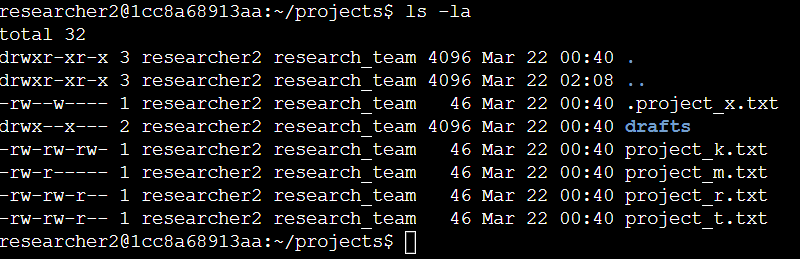
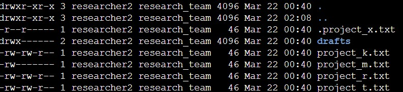

# Linux Access Control Enforcement 
## File Permission Audit

### Overview

I performed a security audit of file and directory permissions within a Linux environment `(/home/researcher2/projects)` to identify and remediate access control weaknesses.

The objective was to enforce the principle of least privilege by removing excessive permissions and restricting access to sensitive resources. This project demonstrates the practical implementation of access control aligned with cybersecurity governance and risk management principles.

### Initial Environment

The /home/researcher2/projects directory contained several files and one subdirectory with inconsistent and overly permissive access settings.

Key issues identified in the initial environment included:

- `project_k.txt` allowed read and write access for owner, group, and others
- `project_r.txt` and ```project_t.txt``` allowed group write access
- `project_x.txt` had inappropriate permissions for a hidden archived file
- the `drafts` directory allowed group execute access, creating unnecessary directory exposure

This initial state introduced risks related to unauthorised modification, excessive permissions, and avoidable access to sensitive content.

### Assessment and Findings

Using the command below, I reviewed all files in the directory, including hidden files:

```bash
ls -la /home/researcher2/projects
```



Using `ls -la` allowed me to review all files in the directory, including hidden files such as `.project_x.txt`, which would not appear in a standard `ls -l` output.

The review identified the following issues:

### Excessive Permissions

Some files had overly permissive access settings. For example:

```bash
-rw-rw-rw- project_k.txt
```

This allowed write access to both group and others, creating a risk of unauthorised modification and weakening data integrity.

### Inconsistent Access Control

Some files had permissions such as:

```bash
-rw-rw-r-- project_r.txt
```

This meant the group still had write access, which was not aligned with least privilege principles.

### Directory Exposure

The `drafts` directory had permissions such as:

```bash
drwx--x--- drafts
```

This allowed group traversal of the directory, introducing risk of unauthorised visibility into sensitive content.

### Interpreting the Permissions String

Linux permissions are shown as a 10-character string. For example:

`-rw-rw-r--`

Each character has a specific meaning:

- the first character indicates the file type
- the next three characters show the owner's permissions
- the following three characters show the group's permissions
- the final three characters show the permissions for others

In this example:

`-` indicates a regular file
`rw-` means the owner can read and write
`rw-` means the group can read and write
`r--` means others can read only

This is important from a security perspective because group write access may allow unauthorised modification of files.

### Permission Interpretation

Linux permissions are represented by three permission groups:

- Owner
- Group
- Others

Linux permissions can also be represented numerically. Each numeric value is a sum of the following permissions:

4 = read
2 = write
1 = execute

Examples used in this project:

- 644 = owner can read and write; group and others can read only
- 440 = owner and group can read only; others have no access
- 700 = owner has full access; group and others have no access

### Remediation Actions

To remove unnecessary write access and standardise permissions across files, I used:

```bash
chmod 644 project_k.txt project_r.txt project_t.txt
```

This ensured that:

- the owner retained read and write access
- group access was reduced to read only
- others were limited to read only
- Secured Sensitive Hidden File

To protect the archived hidden file, I used:

```bash
chmod 440 .project_x.txt
```

This ensured that:

- the owner and group had read-only access
- others had no access
- Restricted Directory Access

To restrict the `drafts` directory so that only the owner could access it, I used:

```bash
chmod 700 drafts
```

This ensured that:

- the owner had full access
- group and others had no access

### Verification of Corrected Permissions

After applying the permission changes, I re-ran `ls -la` to confirm that the files and directory permissions were corrected and aligned with least privilege principles.



### Security Impact

These remediation actions:

- reduced the risk of unauthorised modification
- protected sensitive research data
- strengthened enforcement of access control policies
- improved system integrity and auditability

### GRC Alignment

This project demonstrates how technical controls support broader governance, risk, and compliance objectives, including:

- enforcement of least privilege
- reduction of access control risk
- alignment with role-based access control principles
- practical implementation of security policy enforcement

### Summary

By auditing and correcting file permissions, I transformed a misconfigured environment into one aligned with secure access control practices. This reduced both operational and compliance risk while demonstrating hands-on ability to assess and remediate permission-based security issues in Linux.
