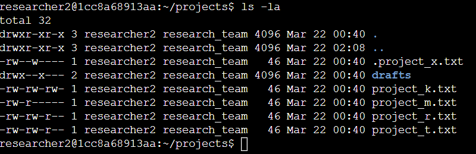
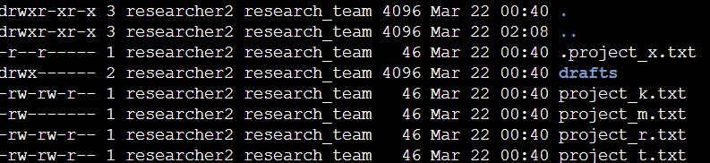

# Linux Access Control Enforcement - File Permission Audit

### 1. Overview

I performed a review of file and directory permissions within a Linux environment `(/home/researcher2/projects)` to identify and remediate access control weaknesses, enforcing the principle of least privilege by removing excessive permissions and restricting access to sensitive resources.

This project demonstrates how technical, file-system access controls reduce security risk and support broader governance and compliance objectives.

Note: This is a hands-on lab exercise (Linux permissions practical, completed as part of the Google Cybersecurity Certificate). It is included to demonstrate
practical command-line ability to assess and enforce least privilege, not to describe a production system.

### 2. Initial Environment

The /home/researcher2/projects directory contained several files and one subdirectory with inconsistent and overly permissive access settings.

Key issues identified included:

- `project_k.txt` allowed read and write access for owner, group, and others
- `project_r.txt` and `project_t.txt` allowed unecessary group write access
- `project_x.txt` (a hidden archived file) had inappropriate permissions. 
- the `drafts` directory allowed group execute access, creating unnecessary directory exposure

This initial state introduced risks related to unauthorised modification, excessive permissions, and avoidable access to sensitive content.

### 3. Assessment and Findings

I reviewed all files in the directory, including hidden files, using:

```bash
ls -la /home/researcher2/projects
```



Using `ls -la`, I reviewed both visible and hidden files to identify excessive permissions and access control weaknesses.

The review identified the following issues:

#### Excessive Permissions

Some files had overly permissive access settings. For example:

```bash
-rw-rw-rw- project_k.txt
```

This created a risk of unauthorised modification and weakened data integrity.

#### Inconsistent Access Control 

Some files had permissions such as:

```bash
-rw-rw-r-- project_r.txt
```

This granted unnecessary group write access and was not aligned with least privilege.

#### Directory Exposure

The `drafts` directory had permissions such as:

```bash
drwx--x--- drafts
```
This allowed unnecessary directory traversal and increased exposure to sensitive content.

#### Remediation Actions

To remove unnecessary write access and standardise permissions across files, I used:

```bash
chmod 644 project_k.txt project_r.txt project_t.txt
```

This ensured that:

- the owner retained read and write access
- group access was reduced to read only
- others were limited to read only
- secured sensitive hidden file

To protect the archived hidden file, I used:

```bash
chmod 440 .project_x.txt
```

This ensured that:

- the owner and group had read-only access
- others had no access
- Restricted Directory Access

To restrict the `drafts` directory so that only the owner could access it, I used:

```bash
chmod 700 drafts
```

This ensured that:

- the owner had full access
- group and others had no access

### 4. Verification 

After applying the permission changes, I re-ran `ls -la` to confirm that the files and directory permissions were corrected and aligned with least privilege principles.



### 5. Security Impact

These remediation actions:

- reduced the risk of unauthorised modification
- protected sensitive research data
- strengthened enforcement of access control policies
- improved system integrity and auditability

### 6. GRC Alignment

This project demonstrates how technical controls support broader governance, risk, and compliance objectives, including:

- enforcement of least privilege
- reduction of access control risk
- practical implementation of access-control policy through file-system (Unix owner/group/other) permissions — a form of discretionary access control (DAC)
- closing the loop through verification of the corrected state

Note on model: this exercise enforces least privilege through Unix file permissions(discretionary access control), which is distinct from role-based access control (RBAC), where permissions are assigned to roles rather than to owner/group/others. Both serve the same least-privilege objective through different mechanisms.

### 7. Summary

By reviewing and correcting file permissions, I moved a misconfigured environment to one aligned with least-privilege access control — reducing operational and security risk and demonstrating hands-on ability to assess and remediate permission-based issues at the Linux command line.
